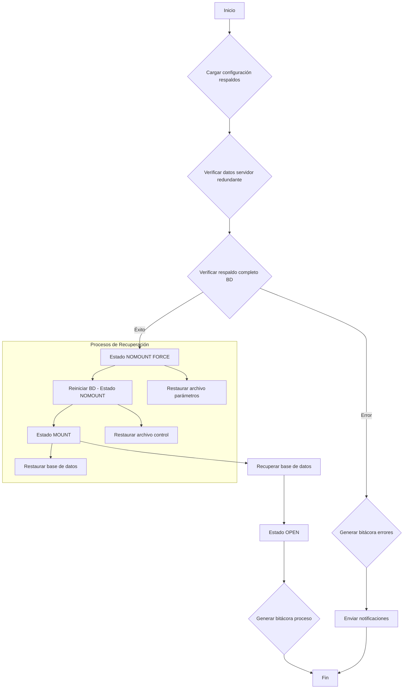

# Presentación Semana 3: Mecanismos de Persistencia y Recuperación
## Logging, WAL, Checkpoints y Algoritmo ARIES

---

## 🎯 Objetivos de la Presentación

- Comprender los **mecanismos de logging** y Write-Ahead Log (WAL)
- Dominar el **algoritmo ARIES** de recuperación de última generación
- Analizar el **rol de los checkpoints** en la sincronización
- Implementar **estrategias de recuperación** ante fallos del sistema
- Aplicar **principios ACID** en persistencia y durabilidad

---

## 📊 Agenda

1. **Fundamentos de Logging y Write-Ahead Log (WAL)**
2. **Algoritmo ARIES: Recuperación de Última Generación**
3. **Checkpoints: Puntos de Sincronización**
4. **Recuperación Ante Fallos del Sistema**
5. **Implementación Práctica en SGBD Modernos**

---

## 🔐 Importancia de la Persistencia y Recuperación

### Contexto Empresarial
> *"La administración de bases de datos requiere un conocimiento profundo de los mecanismos de respaldo y recuperación para asegurar la continuidad del negocio"*

### Relación con Seguridad
> *"La seguridad de la información está estrechamente ligada a los procesos de respaldo y recuperación, que permiten mantener la disponibilidad de los datos incluso después de un fallo"*

### Propiedades ACID Afectadas
- **Atomicidad**: Transacciones completas o nada
- **Durabilidad**: Persistencia de cambios confirmados

---

## 📝 Registro de Operaciones (Logging)

### Definición Fundamental
> *"El registro de operaciones, o log, es la técnica más habitual para la recuperación ante caídas del sistema"*

### Características del Log
- **Almacenamiento consecutivo**: Cambios aplicados secuencialmente
- **Estado de transacciones**: Registro del ciclo de vida completo
- **Almacenamiento estable**: Generalmente en disco
- **Recuperación confiable**: Base para restauración del sistema

### Función Principal
Mantener un histórico completo de todas las modificaciones para poder reconstruir el estado de la base de datos tras un fallo.

---

## 📋 Estructura de Registros de Log

### Registros de Actualización
Cada entrada debe contener:
- **Identificador de Transacción**: Qué transacción realizó el cambio
- **Identificador del Elemento**: Qué dato fue modificado
- **Valor Anterior (V₁)**: Estado previo del dato
- **Valor Nuevo (V₂)**: Estado posterior del dato

### Registros de Control de Transacciones
- **`<Tᵢ start>`**: Inicio de transacción Tᵢ
- **`<Tᵢ commit>`**: Confirmación exitosa de Tᵢ
- **`<Tᵢ abort>`**: Aborto/cancelación de Tᵢ

### Ejemplo de Secuencia de Log
```
<T1 start>
<T1, X, 100, 150>
<T1, Y, 200, 250>
<T1 commit>
<T2 start>
<T2, Z, 300, 350>
<T2 abort>
```

---

## 🚀 Write-Ahead Log (WAL): Concepto Central

### Definición
> *"El Write-Ahead Log (WAL), conocido también como registro anticipado de escritura o bitácora de compromiso (commit log), es una estructura auxiliar de disco de solo anexión (append-only)"*

### Regla Fundamental del WAL
> *"Before a block of data in main memory is output to the database, all log records pertaining to data in that block must have been output to stable storage"*

### Traducción Práctica
**Antes** de escribir cualquier cambio al disco, **primero** se debe escribir el registro correspondiente al log en almacenamiento estable.

---

## 🔒 Principio WAL: Garantías de Consistencia

### Beneficios del WAL
> *"By logging changes before they are applied, it enables recovery from crashes and maintains consistency"*

### Secuencia de Operaciones
1. **Modificación en memoria**: Cambio en buffer/cache
2. **Escritura al log**: Registro en WAL (obligatorio)
3. **Escritura a disco**: Modificación en archivos de datos

### Garantía de Durabilidad
- **Log persistente**: Cambios registrados antes de aplicar
- **Recuperación posible**: Recrear estado desde log
- **Consistencia mantenida**: No hay cambios "perdidos"

---

## 📊 WAL en PostgreSQL: Ejemplo Práctico

### Comando EXPLAIN con WAL
```sql
EXPLAIN (ANALYZE, VERBOSE, BUFFERS, WAL) 
SELECT * FROM public.effective_io_concurrency_test;

-- Resultado:
-- WAL: records=18 bytes=5178
```

### Información Proporcionada
- **Records**: Número de registros de WAL generados
- **Bytes**: Cantidad de datos escritos al WAL
- **Utilidad**: Analizar impacto de operaciones en el log

### Interpretación
Esta información ayuda a entender el costo de operaciones en términos de actividad de logging.

---

## 🔄 Estrategias de Modificación

### 1. Modificación Diferida
- **Comportamiento**: Solo se anota en el log
- **Escritura física**: Solo cuando transacción se compromete
- **Ventaja**: Menor I/O durante ejecución
- **Riesgo**: Fallo durante escritura requiere undo

### 2. Modificación Inmediata
- **Comportamiento**: Escritura inmediata tras logging
- **Timing**: Antes de confirmación de transacción
- **Ventaja**: Datos actualizados continuamente
- **Complejidad**: Requiere mecanismos de undo más sofisticados

---

## 🎯 Algoritmo ARIES: Estado del Arte

### Definición
> *"ARIES (Algorithm for Recovery and Isolation Exploiting Semantics) es un state of the art recovery method"*

### Innovaciones Clave
- **Log Sequence Numbers (LSN)**: Identificación única de registros
- **Compensation Log Records (CLRs)**: Registro de operaciones undo
- **DirtyPageTable**: Seguimiento de páginas modificadas
- **Optimización**: Diseñado para máximo rendimiento

### Diferencias con Métodos Tradicionales
ARIES supera las limitaciones de métodos simplificados mediante estructuras de datos especializadas y algoritmos optimizados.

---

## 🔍 Componentes Técnicos de ARIES

### Log Sequence Numbers (LSN)
- **Función**: Identificador único para cada registro del log
- **Almacenamiento**: Se guardan en páginas de datos
- **Propósito**: Rastrear qué actualizaciones ya se aplicaron
- **Beneficio**: Evita reaplicar operaciones ya ejecutadas

### Compensation Log Records (CLRs)
- **Función**: Registrar acciones durante fase de undo
- **Característica**: No necesitan ser deshechas nuevamente
- **Ventaja**: Evita undo de undo (undo cascading)

### DirtyPageTable
- **Estructura**: Tabla de páginas modificadas en memoria
- **Contenido**: Páginas que no se han sincronizado al disco
- **Uso**: Determinar qué páginas necesitan redo

---

## 🔄 ARIES: Las Tres Fases de Recuperación

### Fase 1: Análisis (Analysis Pass)
> *"El sistema escanea el log desde el último registro de checkpoint"*

**Objetivos determinados:**
- **Transacciones incompletas**: Identificar las que necesitan deshacerse
- **Páginas sucias**: Determinar qué páginas estaban modificadas
- **RedoLSN**: Punto de inicio para la fase de Redo

### Fase 2: Rehacer (Redo Pass)
> *"Repeats history - Repite la historia"*

**Proceso:**
- **Aplicar todas las acciones**: Desde RedoLSN hasta final del log
- **Restaurar estado**: Exactamente como estaba al momento del fallo
- **Incluye todo**: Cambios confirmados y no confirmados

---

## 🔄 ARIES: Fase Final

### Fase 3: Deshacer (Undo Pass)
> *"Rolls back all incomplete transactions - Deshace todas las transacciones incompletas"*

**Metodología:**
- **Escaneo hacia atrás**: Desde final del log hacia atrás
- **Undo-list**: Transacciones identificadas en fase de análisis
- **CLRs**: Generación de registros de compensación
- **Resultado**: Solo transacciones confirmadas permanecen

### Visualización del Proceso
```
Tiempo ←——————————————————————————————————————————————→
       Antiguo    Último checkpoint    Final (Crash!)    Nuevo
Log:   [......] ←—— Análisis ——→ [....] —— Redo ——→ [....] ←— Undo —
```

---

## 📍 Checkpoints: Puntos de Sincronización

### Definición y Propósito
> *"Un punto de control (checkpoint) es un evento que ayuda a sincronizar la caché de buffer de la base de datos con los archivos de datos en el disco"*

### Función Principal
**Reducir trabajo de recuperación** limitando la cantidad de registros del log que deben ser examinados tras un fallo.

### Beneficios
- **Marcador de sincronización**: Punto conocido de consistencia
- **Optimización de recuperación**: Menos log que procesar
- **Rendimiento**: Operación de baja sobrecarga

---

## ⚙️ Implementación de Checkpoints

### Modelo Oracle/Tradicional
**Proceso Checkpoint (CKPT):**
- **Instrucción al DBWR**: Escribir todos los bloques modificados
- **Actualización de headers**: Archivos de datos, Redo Logs, archivos de control
- **Sincronización completa**: Garantía de consistencia en disco

### Modelo ARIES (Optimizado)
- **Logging de checkpoint**: Se registra en el log
- **DirtyPageTable incluida**: Lista de páginas modificadas
- **Transacciones activas**: Estado al momento del checkpoint
- **No escritura inmediata**: Páginas sucias se vacían continuamente en background

---

## 🚨 Recuperación Ante Fallos: Proceso General

### Objetivo de la Recuperación
> *"Garantizar que la base de datos se restablezca a un estado consistente, asegurando que las transacciones confirmadas persistan y que las no confirmadas sean revertidas"*

### Tipos de Fallos
- **Fallo de transacción**: Error en lógica de aplicación
- **Deadlock**: Bloqueo mutuo de recursos
- **Error de software/hardware**: Fallo del sistema
- **Fallo catastrófico**: Pérdida de almacenamiento

### Filosofía de Recuperación
Volver a la normalidad después de un evento inesperado, manteniendo la integridad de los datos.

---

## 🔄 Fases de Recuperación: Redo y Undo

### Rolling Forward (Redo)
> *"Volver a aplicar a los archivos de datos todas las modificaciones guardadas en el archivo de registro de operaciones"*

**En Oracle:**
- **SMON (System Monitor)**: Responsable de aplicar redo logs
- **Objetivo**: Aplicar todas las modificaciones registradas
- **Resultado**: Archivos contienen cambios confirmados Y no confirmados

### Rolling Back (Undo)
**Después del Redo:**
- **Segmentos de rollback**: Identificar transacciones no confirmadas
- **PMON (Process Monitor)**: Detecta errores de proceso de usuario
- **Acciones**: Deshacer cambios, liberar bloqueos y recursos

---

## 🏥 Recuperación Completa en Oracle: Ejemplo

### Secuencia de Recuperación
1. **Restauración**: Recuperar respaldo más reciente
2. **Redo**: Aplicar cambios usando redo logs
3. **Apertura**: Cambiar base de datos a estado OPEN
4. **Undo**: Aplicar rollback para datos no confirmados
5. **Éxito**: Archivos recuperados y consistentes

### Estados de la Base de Datos
- **NOMOUNT**: Cargar archivos de parámetros
- **MOUNT**: Localizar archivos de control
- **OPEN**: Acceso normal de usuarios

---

## 📊 Diagrama de Estados de Recuperación



---

## 💻 Ejemplo Práctico: Análisis de WAL en PostgreSQL

### Consulta de Impacto
```sql
-- Analizar actividad WAL de una consulta
EXPLAIN (ANALYZE, VERBOSE, BUFFERS, WAL) 
UPDATE employees 
SET salary = salary * 1.1 
WHERE department = 'Engineering';

-- Resultado típico:
-- WAL: records=245 bytes=15420
-- Buffers: shared hit=1205 read=15 written=8
```

### Interpretación del Resultado
- **245 registros**: Número de entradas WAL generadas
- **15420 bytes**: Volumen de datos de logging
- **Implicación**: Costo de la operación en términos de logging

---

## 🔧 Configuración WAL en PostgreSQL

### Parámetros Clave
```sql
-- Ver configuración actual
SHOW wal_level;                -- Nivel de detalle del WAL
SHOW checkpoint_segments;      -- Frecuencia de checkpoints
SHOW wal_buffers;             -- Tamaño de buffers WAL

-- Configuración recomendada para alta disponibilidad
ALTER SYSTEM SET wal_level = 'replica';
ALTER SYSTEM SET checkpoint_completion_target = 0.9;
ALTER SYSTEM SET wal_buffers = '16MB';
```

### Monitoreo de WAL
```sql
-- Ver estado actual del WAL
SELECT pg_current_wal_lsn();
SELECT pg_wal_lsn_diff(pg_current_wal_lsn(), '0/0');

-- Estadísticas de checkpoints
SELECT * FROM pg_stat_bgwriter;
```

---

## 📈 Métricas de Rendimiento y Optimización

### Indicadores Clave de WAL
| Métrica | Descripción | Valor Objetivo |
|---------|-------------|----------------|
| **WAL Records/sec** | Registros generados por segundo | < 10,000 |
| **WAL Bytes/sec** | Bytes escritos al WAL | < 50MB/s |
| **Checkpoint frequency** | Frecuencia de checkpoints | 5-15 min |
| **Recovery time** | Tiempo de recuperación | < 5 min |

### Optimizaciones Comunes
- **Batch operations**: Reducir número de transacciones pequeñas
- **Checkpoint tuning**: Ajustar frecuencia según carga
- **WAL compression**: Habilitar compresión cuando disponible
- **Storage optimization**: SSD para WAL, HDD para datos

---

## 🔍 Casos de Uso y Aplicaciones

### Casos Críticos para WAL/ARIES
- **Sistemas financieros**: Transacciones que no pueden perderse
- **E-commerce**: Órdenes de compra y pagos
- **Sistemas médicos**: Historiales críticos de pacientes
- **ERP empresarial**: Operaciones de negocio fundamentales

### Sectores de Aplicación
- **Banca y finanzas**: Cumplimiento regulatorio
- **Telecomunicaciones**: Facturación y servicios
- **Manufactura**: Control de inventario y producción
- **Gobierno**: Registros públicos y servicios ciudadanos

---

## ⚖️ Comparación de Estrategias de Recuperación

### Métodos Tradicionales vs ARIES

| Aspecto | Métodos Tradicionales | ARIES |
|---------|----------------------|-------|
| **Identificación** | Números secuenciales simples | LSN sofisticados |
| **Undo handling** | Undo de undo posible | CLRs previenen cascading |
| **Performance** | Recuperación lenta | Optimizado para velocidad |
| **Complexity** | Relativamente simple | Más complejo pero eficiente |
| **Industry adoption** | Legacy systems | Estándar moderno |

### Selección de Estrategia
- **Sistemas legacy**: Métodos tradicionales pueden ser suficientes
- **Sistemas modernos**: ARIES es prácticamente estándar
- **Alta disponibilidad**: ARIES obligatorio
- **Sistemas simples**: Evaluación caso por caso

---

## 🔮 Tendencias y Evolución

### Desarrollos Modernos
- **WAL-E y WAL-G**: Herramientas de backup continuo
- **Logical replication**: Replicación basada en cambios lógicos
- **Cloud-native databases**: Adaptación de ARIES para la nube
- **NVMe y persistent memory**: Nuevas tecnologías de almacenamiento

### Desafíos Emergentes
- **Big Data**: Volúmenes masivos de transacciones
- **Distributed databases**: Coordinación entre múltiples nodos
- **Real-time analytics**: Balancear OLTP y OLAP
- **Compliance**: Regulaciones de retención de datos

---

## 🎯 Síntesis: Principios Fundamentales

### Garantías del Sistema de Logging
1. **Durabilidad**: Cambios confirmados nunca se pierden
2. **Atomicidad**: Transacciones completas o totalmente revertidas
3. **Consistencia**: Estado válido en todo momento
4. **Eficiencia**: Recuperación rápida y optimizada

### Implementación Exitosa
- **WAL correctamente configurado**: Base de la confiabilidad
- **Checkpoints optimizados**: Balance entre rendimiento y recuperación
- **ARIES cuando sea posible**: Aprovecha décadas de investigación
- **Monitoreo continuo**: Detectar problemas antes que impacten

---

## 💡 Reflexiones Finales

### Preguntas para Considerar
- ¿Cómo **balancear** rendimiento de logging vs tiempo de recuperación?
- ¿Qué **estrategias** usar para sistemas distribuidos modernos?
- ¿Cómo **evolucionar** sistemas legacy hacia ARIES?

### Desafío Profesional
> *"La robustez de un sistema de base de datos se mide no por su rendimiento en condiciones normales, sino por su capacidad de recuperación ante fallos inesperados"*

---

## 🎯 Para Profundizar

### Herramientas de Análisis
- **pg_waldump**: Análisis de archivos WAL en PostgreSQL
- **Oracle LogMiner**: Análisis de redo logs en Oracle
- **MongoDB Oplog**: Equivalent en bases NoSQL

### Recursos Técnicos
- **PostgreSQL documentation**: WAL internals
- **Oracle Recovery Manager**: Documentación RMAN
- **Research papers**: ARIES original paper (Mohan et al.)

### Certificaciones Relevantes
- **Oracle DBA**: Recovery and backup specialization
- **PostgreSQL**: Advanced administration
- **SQL Server**: Database administration track

---

*Presentación basada en el Compendio Exhaustivo sobre Mecanismos de Persistencia y Recuperación: Logging, WAL, Checkpoints y ARIES - Semana 3, LTI_05A_300-SGBD*